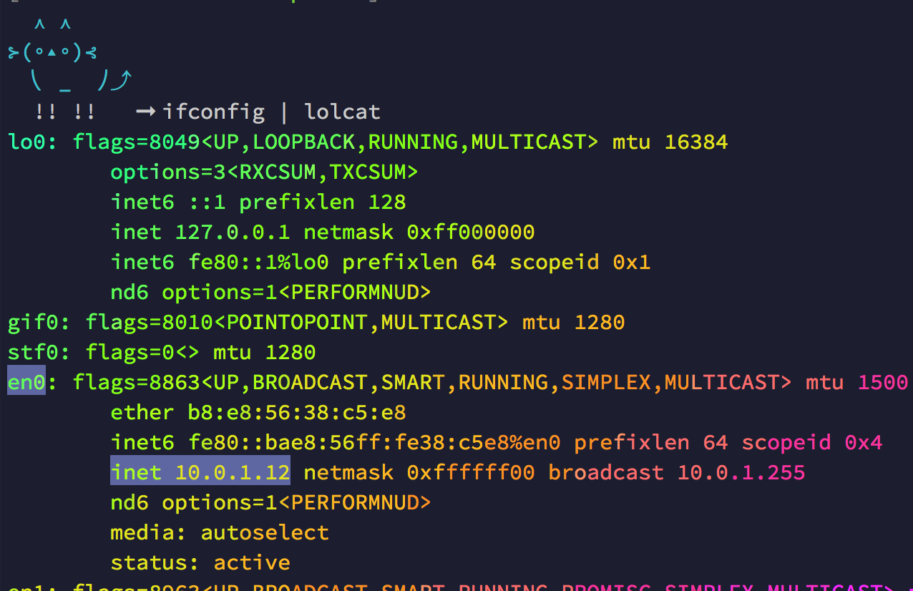

#Mobile Access

To access this on your phone, your phone must be connected to the same network. Go to your terminal and open a new tab. while the server is running, enter the command `ifconfig ` (you can just enter `ifconfig`...youdon't have to download the gem lolcat and use it to output the result in rainbow with `ifconfig | lolcat`, but you could...)

You're looking for your ethernet0 (`en0`) configuration for your internal network (`inet`). 

Now you can pull up your mobile browser on your device and access it at `<inet address>:port`. For example, with the output above, mine would be `10.0.1.12:8000`.

###Mobile Debugging
If you have an iPhone/iPad and want to use an inspector, you can take advantage of the built in mobile debugging tools in Safari. 
- Open Safari and open the preference pane
- Click the Advanced tab and check the box all the way at the bottom to enable the developer menu
- Connect your device to your computer with your cable
- Go to the Develop menu that's now in the menubar and you should see your device.
- Click on your device to activate the inspector.

